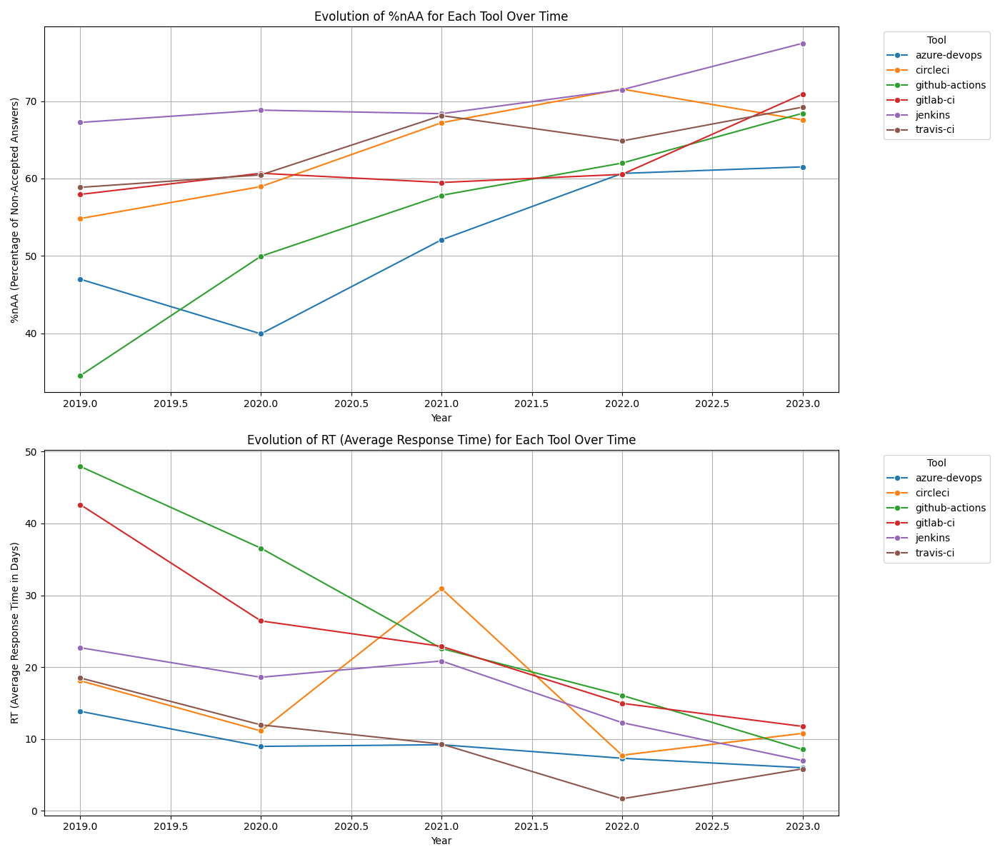
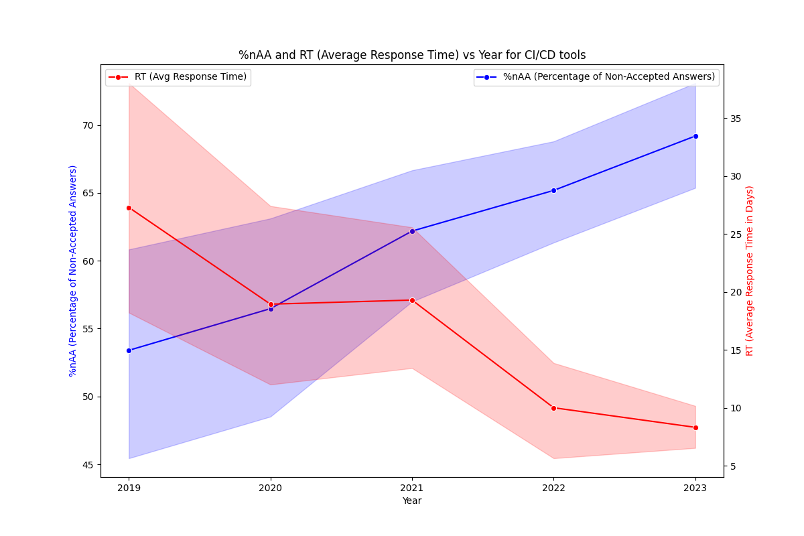
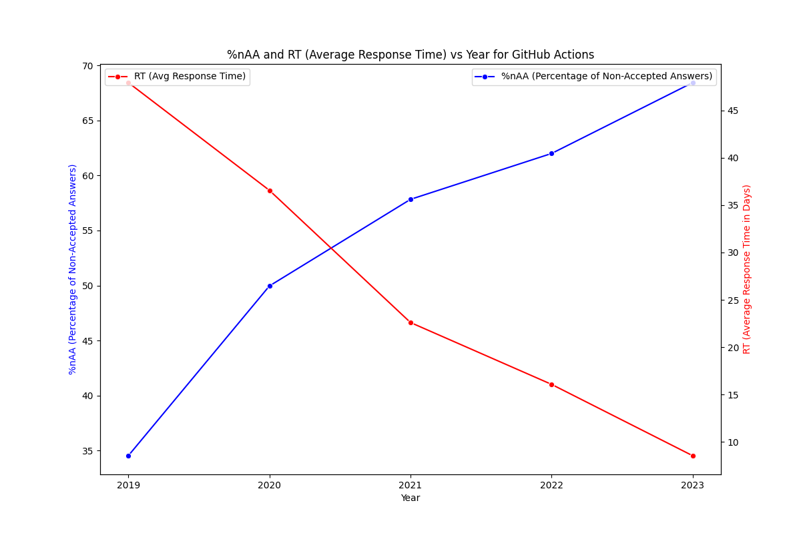

# Analysis of GitHub Actions' Relevance and Difficulty

## Monthly Number of Posts

Para evaluar la relevancia de GitHub Actions (GHA) en comparación con otras herramientas de CI/CD, primero examinamos el número mensual de publicaciones relacionadas con cada herramienta en Stack Overflow. Los datos, extraídos de SEDE (Stack Exchange Data Explorer), abarcan desde 2019 hasta el 3 de agosto de 2024, utilizando los principales tags de las seis herramientas más populares de CI/CD. **Figura 1** a continuación ilustra las tendencias mensuales de publicaciones desde 2019 hasta el mes completo más reciente, julio de 2024.

## Yearly Data Overview

To further investigate, we compiled the data into **Table 1**, which includes the number of questions, the percentage of non-accepted answers (%nAA), and the average response time (RT) for each tool by year.

### Definitions:
- **%nAA (Percentage of Non-Accepted Answers)**: This metric represents the percentage of questions that did not receive an accepted answer. It is calculated by dividing the number of questions without an accepted answer by the total number of questions in a given year.
  
- **RT (Average Response Time)**: This metric indicates the average time taken to receive a response from when a question is posted. It is calculated by averaging the time in days between the creation of the question and the accepted answer. Questions that they do not have an accepted answer will not be considered in this calculation.

Notice, that by the time this study was done, year 2024 was not finished.

#### **Table 1: Data for Various CI/CD Tools (2019-2023)**

| Year | Tool           | Number of Questions | %nAA (Percentage of Questions with No Accepted Answer) | RT (Average Response Time in Days) |
|------|----------------|---------------------|-------------------------------------------------------|------------------------------------|
| 2019 | azure-devops   | 4761                | 46.99%                                                | 13.86                             |
| 2019 | circleci       | 290                 | 54.83%                                                | 18.12                             |
| 2019 | github-actions | 307                 | 34.53%                                                | 47.93                             |
| 2019 | gitlab-ci      | 1013                | 57.95%                                                | 42.62                             |
| 2019 | jenkins        | 5340                | 67.25%                                                | 22.71                             |
| 2019 | travis-ci      | 474                 | 58.86%                                                | 18.50                             |
| 2020 | azure-devops   | 5943                | 39.93%                                                | 8.98                              |
| 2020 | circleci       | 251                 | 58.96%                                                | 11.12                             |
| 2020 | github-actions | 1325                | 49.96%                                                | 36.55                             |
| 2020 | gitlab-ci      | 1315                | 60.68%                                                | 26.43                             |
| 2020 | jenkins        | 4744                | 68.84%                                                | 18.59                             |
| 2020 | travis-ci      | 296                 | 60.47%                                                | 11.97                             |
| 2021 | azure-devops   | 4833                | 52.08%                                                | 9.20                              |
| 2021 | circleci       | 183                 | 67.21%                                                | 30.92                             |
| 2021 | github-actions | 1999                | 57.83%                                                | 22.60                             |
| 2021 | gitlab-ci      | 1560                | 59.49%                                                | 22.89                             |
| 2021 | jenkins        | 3586                | 68.38%                                                | 20.86                             |
| 2021 | travis-ci      | 113                 | 68.14%                                                | 9.30                              |
| 2022 | azure-devops   | 4309                | 60.66%                                                | 7.32                              |
| 2022 | circleci       | 218                 | 71.56%                                                | 7.74                              |
| 2022 | github-actions | 2945                | 62.00%                                                | 16.07                             |
| 2022 | gitlab-ci      | 1475                | 60.54%                                                | 14.96                             |
| 2022 | jenkins        | 3071                | 71.84%                                                | 12.83                             |
| 2022 | travis-ci      | 37                  | 64.86%                                                | 1.68                              |
| 2023 | azure-devops   | 2923                | 61.51%                                                | 6.00                              |
| 2023 | circleci       | 111                 | 67.57%                                                | 10.79                             |
| 2023 | github-actions | 2899                | 68.44%                                                | 8.54                              |
| 2023 | gitlab-ci      | 1131                | 70.91%                                                | 11.75                             |
| 2023 | jenkins        | 2118                | 77.48%                                                | 6.99                              |
| 2023 | travis-ci      | 13                  | 69.23%                                                | 5.85                              |
| 2024 | azure-devops   | 1851                | 49.81%                                                | 1.43                              |
| 2024 | circleci       | 33                  | 84.85%                                                | 4.59                              |
| 2024 | github-actions | 1387                | 76.42%                                                | 3.29                              |
| 2024 | gitlab-ci      | 526                 | 76.05%                                                | 3.93                              |
| 2024 | jenkins        | 991                 | 83.25%                                                | 1.98                              |
| 2024 | travis-ci      | 7                   | 57.14%                                                | 0.35                              |

## Trends in %nAA and RT Over Time

**Figure 3** shows the evolution of the percentage of non-accepted answers (%nAA) and the average response time (RT) for GitHub Actions and other CI/CD tools over time.

### Interpretation of Trends

From **Figure 4** and **Figure 5**, which provide alternative visualizations, it is evident that for GitHub Actions, the %nAA has consistently increased over time, while the RT has decreased. This suggests that while GitHub Actions is becoming more popular, it is also becoming more difficult for the community to provide accepted answers, as reflected in the increasing %nAA. Conversely, the decreasing RT indicates that answers are being provided more quickly, even if they are not always accepted.

### Correlation Between Popularity and Difficulty

**Table 2** and **Table 3** explore the correlation between %nAA and popularity (measured by the number of questions), as well as RT and popularity.

**Table 2: Correlation between %nAA and Popularity**

| Tool           | Correlation (%nAA vs Popularity) |
|----------------|----------------------------------|
| azure-devops   | -0.884598                        |
| circleci       | -0.701330                        |
| github-actions | 0.971624                         |
| gitlab-ci      | -0.270068                        |
| jenkins        | -0.875577                        |
| travis-ci      | -0.897390                        |

**Table 3: Correlation between RT and Popularity**

| Tool           | Correlation (RT vs Popularity) |
|----------------|--------------------------------|
| azure-devops   | 0.487261                       |
| circleci       | 0.006772                       |
| github-actions | -0.977778                      |
| gitlab-ci      | -0.461482                      |
| jenkins        | 0.880743                       |
| travis-ci      | 0.941690                       |

**Overall Correlations**:

Overall Correlation (%nAA vs Popularity): -0.17 Overall Correlation (RT vs Popularity): -0.15

## Correlation between %nAA and RT

Correlation measures the strength and direction of a linear relationship between two variables. Below, **Table 4** presents the correlation between %nAA and RT for each tool, highlighting the overall trend across all tools.

**Table 4: Correlation (%nAA vs RT)**

| Tool         | Correlation (%nAA vs RT) |
|--------------|--------------------------|
| azure-devops | -0.615948                 |
| circleci     | -0.100888                 |
| github-actions | -0.984399               |
| gitlab-ci    | -0.690472                 |
| jenkins      | -0.964885                 |
| travis-ci    | -0.701523                 |
| Overall      | -0.445850                 |
